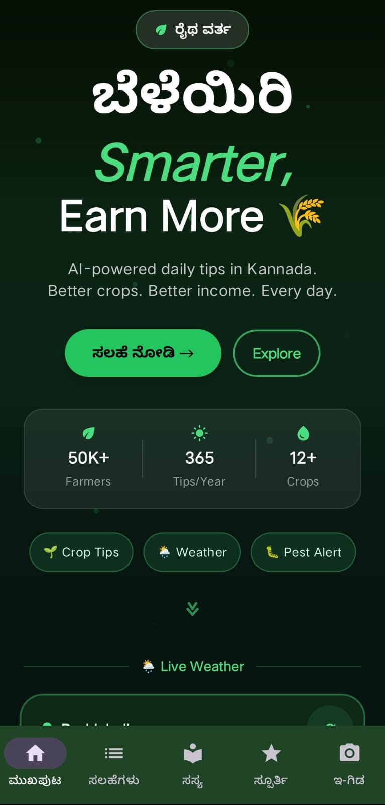
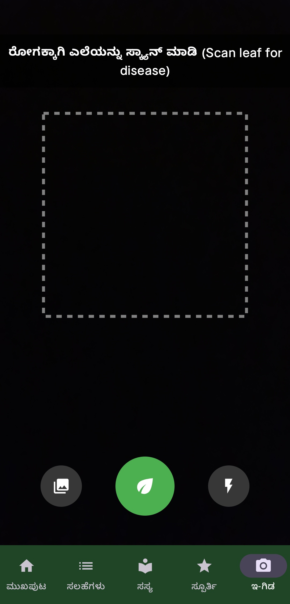
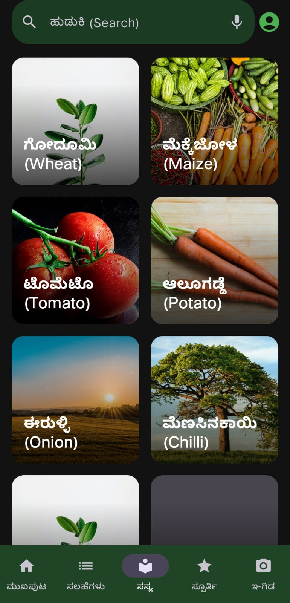
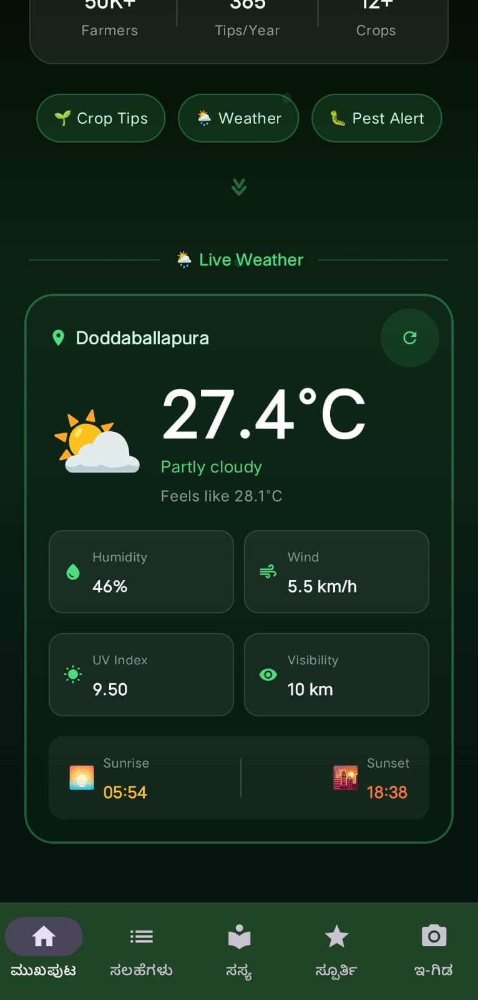
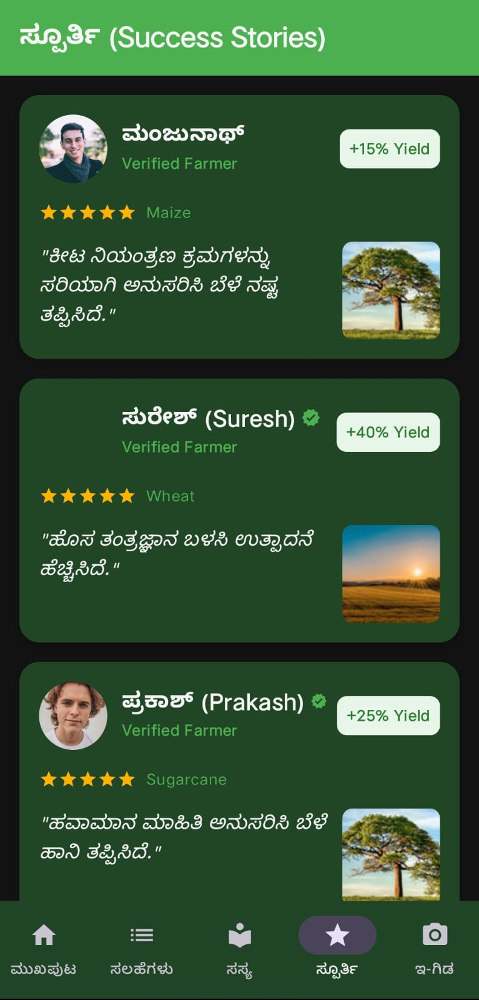
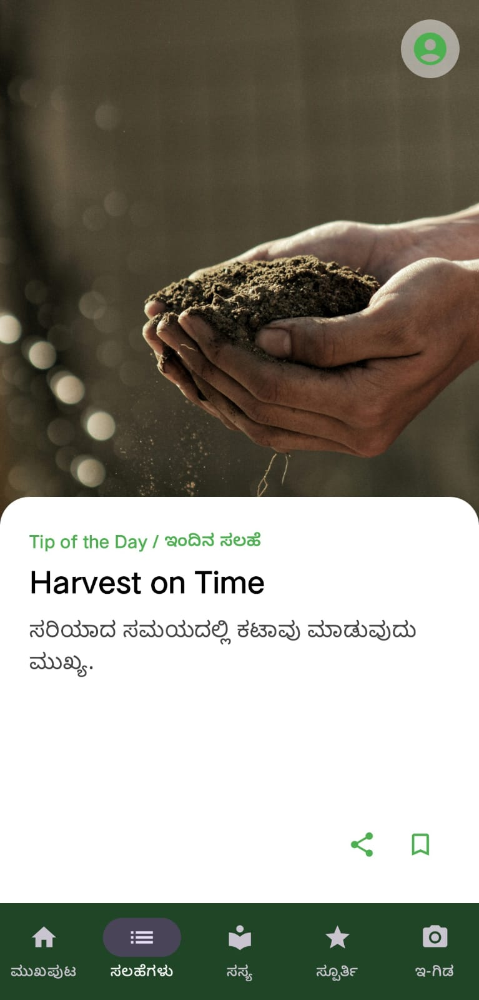
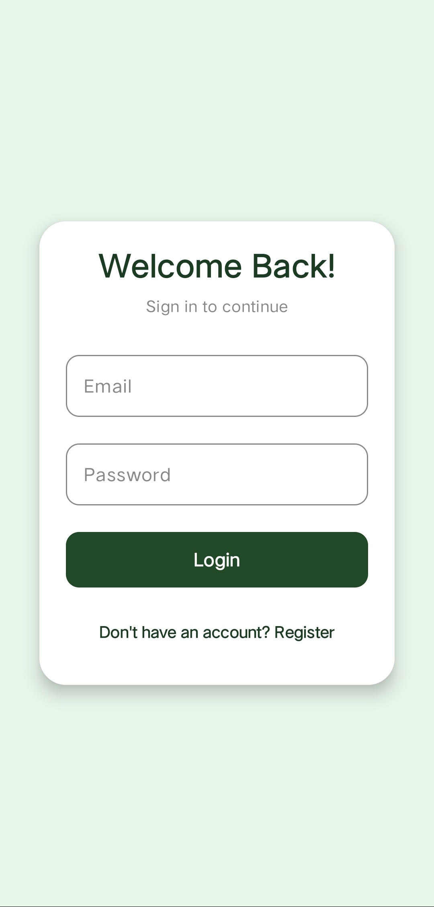

# ರೈತ ವಾರ್ತೆ - Raitha Vartha

<div align="center">



**AI-Powered Farming Intelligence Platform for Indian Farmers**

[Download](#-installation) • [Features](#-key-features) • [Tech Stack](#-technology-stack) • [Contributing](#-contributing)

[](https://www.android.com/)
[](https://kotlinlang.org/)
[](https://firebase.google.com/)
[](https://developer.android.com/jetpack/compose)
[](#-license)

</div>

---

## 📱 About Raitha Vartha

**Raitha Vartha** (ರೈತ ವಾರ್ತೆ) means "Farmer News" or "Farmer Information" in Kannada. It is a cutting-edge Android application designed to empower farmers in Karnataka and across India with real-time agricultural information, AI-powered crop diagnostics, actionable farming tips, and a supportive community platform.

The app bridges the gap between traditional farming knowledge and modern technology, providing farmers with:

- **Instant AI-powered disease diagnosis** for crops
- **Real-time weather insights** tailored to their location
- **Curated daily farming tips** based on crop type and season
- **Community success stories** for inspiration and knowledge sharing
- **Marketplace features** connecting farmers with vendors

All features are delivered with a premium, user-friendly interface localized entirely in **Kannada** (ಕನ್ನಡ) for maximum accessibility.

---

## ✨ Key Features

### 1. 🧠 AI-Powered Crop Diagnostics (e-Gidha / ಇ-ಗಿಡ)

Take a photo of any plant leaf or crop, and our intelligent system instantly analyzes it:

| Feature                  | Details                                                        |
| ------------------------ | -------------------------------------------------------------- |
| **Plant Identification** | Using **Google Gemini AI** for multi-modal image analysis      |
| **Disease Detection**    | Automatic identification of diseases, pests, and health issues |
| **Kannada Solutions**    | Detailed explanations in Kannada with 2 actionable remedies    |
| **Offline Support**      | Works with cached models for areas with poor connectivity      |

<div align="center">



_e-Gidha Feature: Scan leaves to detect diseases and get instant solutions_

</div>

---

### 2. 📋 Actionable Farming Tips & Crop Library (Sasya / ಸಸ್ಯ)

Access a comprehensive library of curated farming tips:

| Capability               | Description                                                          |
| ------------------------ | -------------------------------------------------------------------- |
| **Daily Tips**           | Personalized, actionable farming advice updated regularly            |
| **Crop Filtering**       | Browse tips by crop type (Wheat, Maize, Tomato, Onion, Chilli, etc.) |
| **Seasonal Guidance**    | Tips aligned with planting, growth, and harvesting seasons           |
| **Search Functionality** | Quick access to specific crop information and techniques             |
| **Bookmark System**      | Save favorite tips for quick reference                               |

<div align="center">



_Sasya Library: Browse and filter farming tips by crop type_

</div>

---

### 3. 🌦️ Real-Time Weather Integration

Get accurate, hyperlocal weather data for better farming decisions:

| Data Point                   | Source                                        |
| ---------------------------- | --------------------------------------------- |
| **Temperature & Conditions** | Live weather with emoji indicators            |
| **Wind Speed & Direction**   | For optimal spraying and harvesting decisions |
| **Humidity Levels**          | Critical for disease prevention               |
| **UV Index**                 | For sun exposure and worker safety            |
| **Sunrise/Sunset Times**     | For optimal farming activity scheduling       |
| **API Source**               | **Open-Meteo API** for fast, reliable data    |

<div align="center">



_Real-time Weather: Comprehensive environmental data for informed farming decisions_

</div>

---

### 4. ⭐ Spoorthi (Success Stories / ಸೂಚಿತ)

Get inspired by real success stories from verified farmers in your region:

<div align="center">



_Spoorthi Section: Learn from farmers who achieved 15-40% yield improvements_

</div>

**Features:**

- ✅ Verified farmer profiles with ratings
- 📊 Documented yield improvements (e.g., +15%, +40%, +25%)
- 🌾 Success metrics by crop type
- 📸 Real agricultural outcomes with images
- 💬 Detailed testimonials in Kannada

---

### 5. 💡 Daily Tips & Notifications (ಇಂದಿನ ಸಲಹೆ)

Never miss critical farming advice:

<div align="center">



_Daily tips delivered with context-aware agricultural guidance_

</div>

---

### 6. 🏪 Marketplace (Coming Soon)

Connect directly with agricultural vendors and suppliers.

---

## 📊 Dashboard Overview

<div align="center">


_Main Dashboard: 50K+ Farmers | 365 Tips/Year | 12+ Crops Supported_

</div>

---

## 🔐 Authentication & User Roles

### Farmer Role 👨‍🌾

- Access to all AI diagnostics features
- Real-time weather and location-based insights
- Curated farming tips and seasonal guidance
- Community success stories and inspiration
- Profile management and preference settings

### Vendor Role 🏪

- Marketplace dashboard
- Product listings and management
- Farmer connections and outreach
- Sales analytics and performance tracking

### Authentication Method

- **Phone Number-based Authentication** via Firebase
- **Role Selection** at first login
- **Secure Session Management** with biometric support

<div align="center">



_Secure Authentication: Welcome back existing users with phone-based login_

</div>

---

## 🛠️ Technology Stack

### 📱 Android Frontend

```
┌─────────────────────────────────────┐
│   Jetpack Compose UI Layer          │
│   (Material 3 - Modern & Responsive)│
└──────────────┬──────────────────────┘
               │
┌──────────────▼──────────────────────┐
│   Kotlin + Coroutines + Flow        │
│   (Async Operations & State)        │
└──────────────┬──────────────────────┘
               │
┌──────────────▼──────────────────────┐
│   MVVM + Repository Pattern         │
│   (Clean Architecture)              │
└──────────────┬──────────────────────┘
               │
┌──────────────▼──────────────────────┐
│   Room Database | Firestore | APIs  │
│   (Data Layer)                      │
└─────────────────────────────────────┘
```

| Category             | Technology            | Purpose                                |
| -------------------- | --------------------- | -------------------------------------- |
| **Language**         | Kotlin                | Type-safe, concise Android development |
| **UI Framework**     | Jetpack Compose       | Modern, declarative UI with animations |
| **UI Theme**         | Material 3            | Professional, earthy color palette     |
| **Architecture**     | MVVM                  | Clean separation of concerns           |
| **State Management** | ViewModel + StateFlow | Reactive, lifecycle-aware state        |
| **Database**         | Room                  | Local caching and offline support      |
| **Networking**       | Retrofit + OkHttp     | RESTful API communication              |
| **Image Loading**    | Coil                  | Efficient image caching and loading    |
| **Async**            | Coroutines & Flow     | Non-blocking operations                |

### 🤖 Artificial Intelligence

| AI Service           | Use Case                  | Capability                                        |
| -------------------- | ------------------------- | ------------------------------------------------- |
| **Google Gemini AI** | Crop disease detection    | Multi-modal image analysis, plant identification  |
| **Groq API**         | Agricultural explanations | High-speed LLM for Kannada solutions and remedies |

### ☁️ Backend & Infrastructure

| Service                     | Purpose          | Features                                             |
| --------------------------- | ---------------- | ---------------------------------------------------- |
| **Firebase Authentication** | User login       | Phone number verification, role-based access         |
| **Firestore Database**      | Data persistence | Tips, success stories, user profiles, real-time sync |
| **Firebase Storage**        | Media management | Agricultural images, profile photos                  |
| **Cloud Functions**         | Backend logic    | Node.js functions for complex operations             |
| **Open-Meteo API**          | Weather data     | Location-specific forecasting, no API key required   |

### 🔧 Development Tools

- **Build System**: Gradle (Kotlin DSL)
- **Minimum SDK**: Android 8.0 (API 26)
- **Target SDK**: Android 14 (API 34)
- **Compiler**: JDK 17
- **IDE**: Android Studio Ladybug+

---

## 📁 Project Structure

```
Raitha_Vartha/
├── app/                              # Main Android application
│   ├── src/main/
│   │   ├── java/com/raithavarta/
│   │   │   ├── ai/                  # AI service integrations
│   │   │   │   ├── GeminiService    # Gemini AI for disease detection
│   │   │   │   └── GroqService      # Groq for Kannada explanations
│   │   │   ├── data/                # Data layer
│   │   │   │   ├── local/           # Room database, DAOs
│   │   │   │   └── remote/          # Firestore utilities
│   │   │   ├── model/               # Data models & entities
│   │   │   ├── repository/          # Repository pattern implementation
│   │   │   ├── ui/                  # UI layer
│   │   │   │   ├── navigation/      # Navigation graph (AppNavigation.kt)
│   │   │   │   ├── screens/         # All composable screens
│   │   │   │   │   ├── SplashScreen
│   │   │   │   │   ├── RoleSelectionScreen
│   │   │   │   │   ├── EmailAuthScreen
│   │   │   │   │   ├── HomeScreen
│   │   │   │   │   ├── CameraScreen (e-Gidha)
│   │   │   │   │   ├── FarmerDashboardScreen
│   │   │   │   │   ├── SasyaLibraryScreen
│   │   │   │   │   ├── SpoorthiScreen
│   │   │   │   │   ├── ProfileScreen
│   │   │   │   │   ├── MarketplaceScreen
│   │   │   │   │   ├── ProductDetailScreen
│   │   │   │   │   └── VendorDashboardScreen
│   │   │   │   └── theme/           # Material 3 theme & colors
│   │   │   ├── utils/               # Utility functions & helpers
│   │   │   ├── viewmodel/           # ViewModels for state management
│   │   │   └── MainActivity.kt      # Entry point
│   │   └── res/                     # Android resources (layouts, strings, colors)
│   ├── build.gradle.kts             # App-level Gradle configuration
│   └── google-services.json         # Firebase configuration
├── functions/                        # Backend Cloud Functions
│   ├── index.js                     # Node.js Cloud Function logic
│   └── package.json                 # Dependencies
├── gradle/                           # Gradle wrapper
├── build.gradle.kts                 # Project-level Gradle
├── settings.gradle.kts              # Gradle settings
├── local.properties                 # Local configuration (API keys)
└── README.md                        # This file
```

---

## 🚀 Installation & Setup

### Prerequisites

Before you begin, ensure you have the following installed:

- **Android Studio** (Ladybug or newer) - [Download](https://developer.android.com/studio)
- **JDK 17 or higher** - [Download](https://adoptopenjdk.net/)
- **Git** - [Download](https://git-scm.com/)

### Required Credentials

1. **Firebase Project** - [Setup Guide](https://firebase.google.com/docs/android/setup)
   - Create a Firebase project
   - Enable Authentication (Phone Number)
   - Enable Firestore Database
   - Download `google-services.json`

2. **Google Gemini API Key** - [Get API Key](https://ai.google.dev/)
   - Sign up for Google AI
   - Create API key with Gemini 1.5 access

3. **Groq API Key** - [Get API Key](https://console.groq.com/)
   - Sign up for Groq Cloud
   - Generate API key for LLaMA models

### Step-by-Step Installation

#### 1. Clone the Repository

```bash
git clone https://github.com/your-username/Raitha_Vartha.git
cd Raitha_Vartha
```

#### 2. Configure Local Properties

Create or update `local.properties` in the project root:

```properties
# API Keys
GEMINI_API_KEY=your_gemini_api_key_here
GROQ_API_KEY=your_groq_api_key_here

# Firebase (optional, if using custom config)
firebase.project_id=your_project_id
```

#### 3. Add Firebase Configuration

Place your `google-services.json` file in the `app/` directory:

```bash
# Copy from Firebase Console
cp ~/Downloads/google-services.json app/
```

#### 4. Open in Android Studio

- Open Android Studio
- Click **File** → **Open**
- Select the `Raitha_Vartha` folder
- Wait for Gradle sync to complete

#### 5. Create/Select Emulator or Device

- Open AVD Manager (Tools → Device Manager)
- Create a new virtual device (API 26+) or connect a physical device
- Ensure USB debugging is enabled on physical devices

#### 6. Build & Run

```bash
# Build from terminal
./gradlew build

# Or use Android Studio
# Click "Run" (Shift + F10)
```

Expected output:

```
BUILD SUCCESSFUL in 45s
```

#### 7. First Launch

- App starts with Splash Screen
- Select Role (Farmer or Vendor)
- Enter phone number for authentication
- OTP verification via Firebase
- Grant permissions for Camera, Location, Storage
- Start exploring!

---

## 📖 Usage Guide

### For Farmers

1. **Login with Phone Number**
   - Enter your phone number
   - Verify with OTP
   - Select "Farmer" role

2. **Use AI Diagnostics**
   - Tap the Camera icon on dashboard
   - Take or upload a leaf/plant photo
   - Get instant disease diagnosis with solutions

3. **Browse Farming Tips**
   - Go to Sasya Library
   - Filter by crop type
   - Read daily tips and seasonal guidance

4. **Check Weather**
   - Allow location permission
   - View real-time weather for your area
   - Plan farming activities accordingly

5. **Get Inspired**
   - Visit Spoorthi section
   - Read success stories from other farmers
   - Learn best practices and techniques

### For Vendors

1. **Login with Phone Number**
   - Enter your phone number
   - Verify with OTP
   - Select "Vendor" role

2. **Manage Products**
   - Add agricultural products
   - Set pricing and availability
   - Manage inventory

3. **Connect with Farmers**
   - View farmer requests
   - Respond to inquiries
   - Build your customer base

---

## 🏗️ Architecture & Design Patterns

### Clean Architecture

The application follows **Clean Architecture** principles with clear separation of concerns:

```
┌─────────────────────────────────────────┐
│         UI Layer (Presentation)         │
│  ┌──────────────────────────────────┐   │
│  │  Screens (Composables)           │   │
│  │  State Management (ViewModel)    │   │
│  └──────────────────────────────────┘   │
└────────────────┬────────────────────────┘
                 │
┌────────────────▼────────────────────────┐
│     Domain Layer (Business Logic)       │
│  ┌──────────────────────────────────┐   │
│  │  Use Cases / ViewModels          │   │
│  │  Repository Interfaces           │   │
│  └──────────────────────────────────┘   │
└────────────────┬────────────────────────┘
                 │
┌────────────────▼────────────────────────┐
│      Data Layer (Data Access)           │
│  ┌──────────────────────────────────┐   │
│  │  Repositories (Implementation)   │   │
│  │  Local (Room) | Remote (Firebase)│   │
│  │  Remote APIs (Gemini, Groq)      │   │
│  └──────────────────────────────────┘   │
└─────────────────────────────────────────┘
```

### Design Patterns Used

| Pattern                  | Usage                                 |
| ------------------------ | ------------------------------------- |
| **MVVM**                 | Separation of UI and business logic   |
| **Repository**           | Abstract data access (Local & Remote) |
| **Dependency Injection** | Component management and testing      |
| **Observer**             | State flow and reactive updates       |
| **Singleton**            | API clients, database instances       |
| **Factory**              | ViewModel creation with parameters    |

---

## 🧪 Testing

### Unit Tests

```bash
./gradlew test
```

### Instrumentation Tests

```bash
./gradlew connectedAndroidTest
```

### Test Coverage

```bash
./gradlew testDebugUnitTestCoverage
```

---

## 📦 Dependencies

### Core Dependencies

```kotlin
// Jetpack
implementation("androidx.compose.ui:ui:1.6.0")
implementation("androidx.compose.material3:material3:1.1.1")
implementation("androidx.lifecycle:lifecycle-viewmodel-compose:2.6.1")
implementation("androidx.navigation:navigation-compose:2.7.4")

// Firebase
implementation("com.google.firebase:firebase-auth-ktx:22.3.0")
implementation("com.google.firebase:firebase-firestore-ktx:24.9.1")
implementation("com.google.firebase:firebase-storage-ktx:20.2.1")

// Networking
implementation("com.squareup.retrofit2:retrofit:2.10.0")
implementation("com.squareup.okhttp3:okhttp:4.11.0")

// Database
implementation("androidx.room:room-runtime:2.6.0")
kapt("androidx.room:room-compiler:2.6.0")

// Async
implementation("org.jetbrains.kotlinx:kotlinx-coroutines-android:1.7.3")

// Image Loading
implementation("io.coil-kt:coil-compose:2.4.0")
```

---

## 🤝 Contributing

We welcome contributions from the community! Whether you're fixing bugs, adding features, or improving documentation, your help is appreciated.

### How to Contribute

1. **Fork the Repository**

   ```bash
   git clone https://github.com/your-username/Raitha_Vartha.git
   ```

2. **Create a Feature Branch**

   ```bash
   git checkout -b feature/AmazingFeature
   ```

3. **Make Your Changes**
   - Follow [Kotlin Style Guide](https://kotlinlang.org/docs/coding-conventions.html)
   - Write clear commit messages
   - Add/update tests as needed

4. **Commit Your Changes**

   ```bash
   git commit -m 'Add AmazingFeature'
   ```

5. **Push to Branch**

   ```bash
   git push origin feature/AmazingFeature
   ```

6. **Open a Pull Request**
   - Describe your changes in detail
   - Reference any related issues
   - Wait for review and feedback

### Development Guidelines

- **Code Style**: Follow Kotlin conventions and Android best practices
- **Comments**: Document complex logic and public APIs
- **Testing**: Write tests for new features
- **Performance**: Optimize for low-end devices (API 26+)
- **Accessibility**: Ensure WCAG 2.1 AA compliance

---

## 📋 Roadmap

### Version 1.0 ✅

- [x] Core AI diagnostics (Gemini integration)
- [x] Weather integration (Open-Meteo)
- [x] Farming tips library (Sasya)
- [x] Success stories (Spoorthi)
- [x] Authentication (Firebase Phone OTP)
- [x] Kannada localization

### Version 1.1 (Planned)

- [ ] Pest alert notifications
- [ ] Advanced crop calendar
- [ ] Farmer marketplace
- [ ] Vendor dashboard refinements
- [ ] Video tutorials

### Version 2.0 (Future)

- [ ] IoT sensor integration
- [ ] Soil analysis via image
- [ ] Market price tracking
- [ ] Agricultural insurance information
- [ ] Community forums
- [ ] Multi-language support

---

## 🐛 Known Issues & Troubleshooting

### Issue: "API Key not found" Error

**Solution:**

- Verify `local.properties` file exists
- Check spelling of `GEMINI_API_KEY` and `GROQ_API_KEY`
- Ensure keys are valid and not expired

### Issue: Firebase Authentication Fails

**Solution:**

- Confirm `google-services.json` is in `app/` directory
- Check Firebase Console for enabled Phone Authentication
- Verify project ID matches configuration

### Issue: Camera Permission Denied

**Solution:**

- Grant camera permission in device settings
- Uninstall and reinstall the app
- Clear app cache and data

### Issue: Weather Data Not Loading

**Solution:**

- Check internet connection
- Verify location services enabled
- Open-Meteo API might be temporarily unavailable

---

## 📄 License

This project is licensed under the **MIT License** - see the [LICENSE](LICENSE) file for details.

```
MIT License

Permission is hereby granted, free of charge, to any person obtaining a copy
of this software and associated documentation files (the "Software"), to deal
in the Software without restriction, including without limitation the rights
to use, copy, modify, merge, publish, distribute, sublicense, and/or sell
copies of the Software, and to permit persons to whom the Software is
furnished to do so, subject to the following conditions:

The above copyright notice and this permission notice shall be included in all
copies or substantial portions of the Software.
```

---

## 🙋 Support & Contact

Have questions or need help? We're here to support you!

### Get Help

- 📖 **Documentation**: See the [Wiki](https://github.com/your-username/Raitha_Vartha/wiki)
- 🐛 **Report Issues**: [GitHub Issues](https://github.com/your-username/Raitha_Vartha/issues)
- 💬 **Discussions**: [GitHub Discussions](https://github.com/your-username/Raitha_Vartha/discussions)
- 📧 **Email**: support@raithavarta.com

### Connect With Us

- 🌐 Website: [raithavarta.com](https://raithavarta.com)
- 📱 Twitter: [@RaithaVarta](https://twitter.com/raithavarta)
- 📘 Facebook: [Raitha Vartha](https://facebook.com/raithavarta)
- 📧 Newsletter: [Subscribe](https://raithavarta.com/newsletter)

---

## 🙏 Acknowledgments

This project would not have been possible without:

- **Google Gemini AI** - For powerful image analysis capabilities
- **Groq** - For fast, efficient LLM inference
- **Firebase Team** - For excellent backend infrastructure
- **Open-Meteo** - For free, reliable weather data
- **Jetpack Compose Team** - For modern, responsive UI framework
- **Farming Community** - For inspiration and validation

Special thanks to all contributors and farmers who provided feedback during development!

---

<div align="center">

## 🌾 Supporting Indian Farmers Through Technology 🌾

Made with ❤️ for the farming community

[⬆ Back to Top](#-raitha-vartha)

</div>
